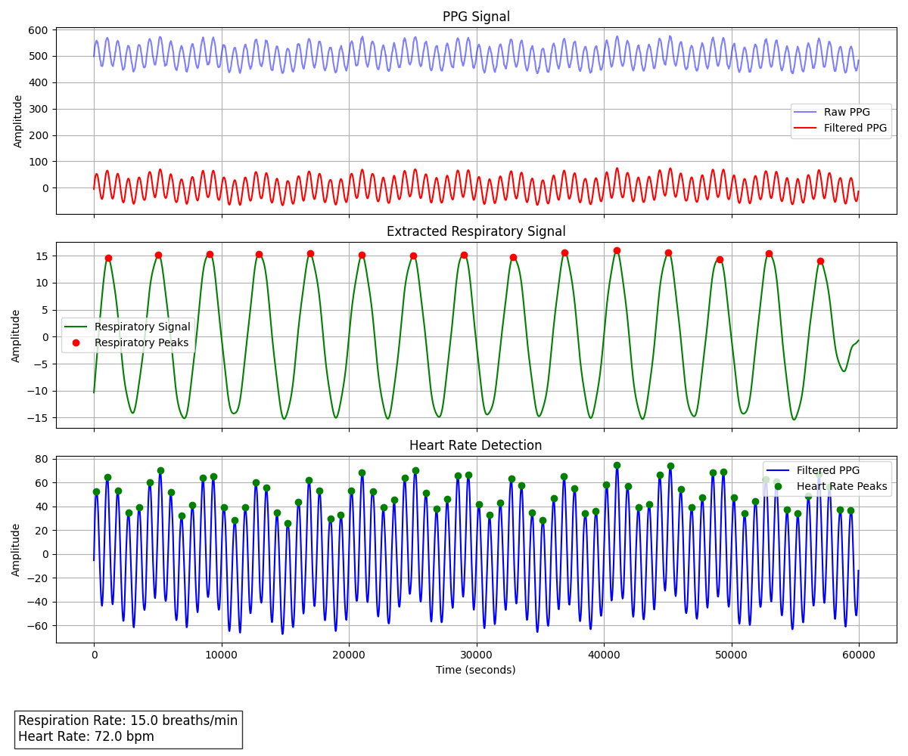
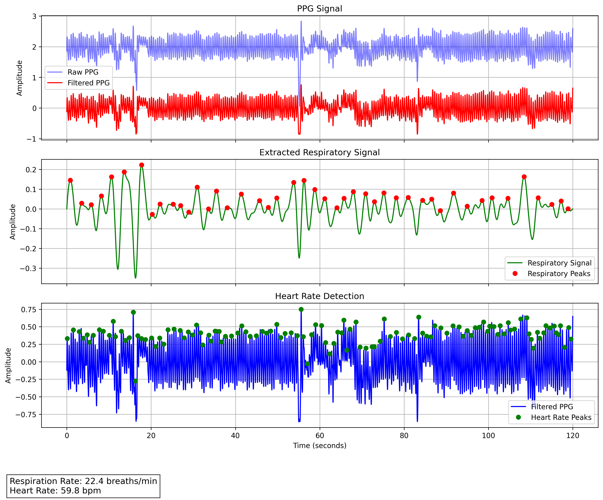
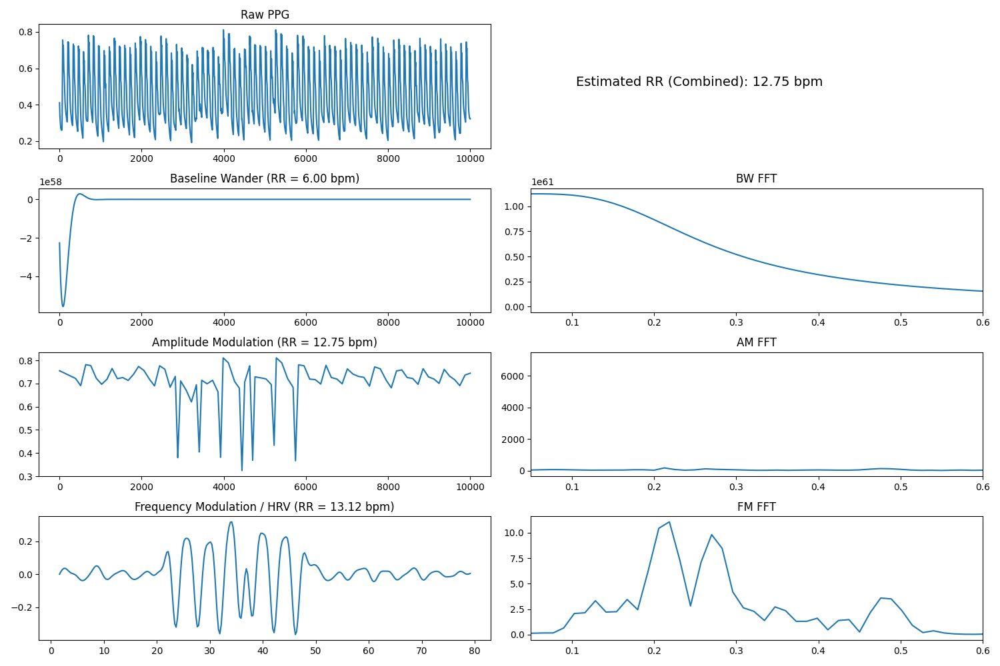

# Heart Rate and Respiration Rate Detection from Dummy And Real PPG Sensor Data

This project demonstrates the generation, processing, and analysis of synthetic Photoplethysmogram (PPG) data to detect heart rate and respiration rate. The implementation includes generating synthetic PPG data, saving it to a file, analyzing it using a custom `PPGRespirationAnalyzer` class, and visualizing the results. The project also shows demo with real PPG datasets like MIMIC PERform datasets.

### Graph for dummy data



## Graph for real data (mimic PERform PPG) for naive algorithm

Example call

```
python/ppg_basic.py dataset/mimic_perform_non_af_csv/mimic_perform_non_af_001_data.csv --sampling-rate 125 --limit 10000
```



## Graph for real data (mimic PERform PPG) for advance algorithm

Look into the python/ppg_respiration_rate.py file for detail



### About datasets:

The MIMIC PERform datasets a collection of datasets extracted from the MIMIC III Waveform Database. These datasets focus on physiological signals from critically-ill patients, often during routine clinical care, and are useful for researchers and developers working on machine learning or signal processing tasks related to medical data.

**Link:** [https://paperswithcode.com/dataset/mimic-perform-testing-dataset](https://paperswithcode.com/dataset/mimic-perform-testing-dataset)

## Features

- **Synthetic PPG Data Generation**: Simulates PPG signals with components for heart rate, respiration, baseline drift, and noise.
- **Data Saving**: Saves the generated PPG data and timestamps to a JSON file.
- **PPG Analysis**: Detects heart rate and respiration rate from the PPG signal using preprocessing and signal analysis techniques.
- **Visualization**: Plots the results of the analysis and saves the output as an image.

## Requirements

The project requires the following Python libraries, which can be installed using the `requirements.txt` file:

```bash
pip install -r requirements.txt
```

## Dependencies:

- **numpy:** For numerical computations.
- **matplotlib:** For plotting and visualization.
- **scipy:** For signal processing.
- **pandas:** For handling data files.
- **PyWavelets:** For handling wavelet manipulation.

## Example Results

Below is an example of the results obtained from analyzing synthetic PPG data:

```
Heart Rate: 72 bpm
Respiration Rate: 15 breaths/min
```

## License

This project is for demonstration purposes and is provided under an Apache 2.0 license.
